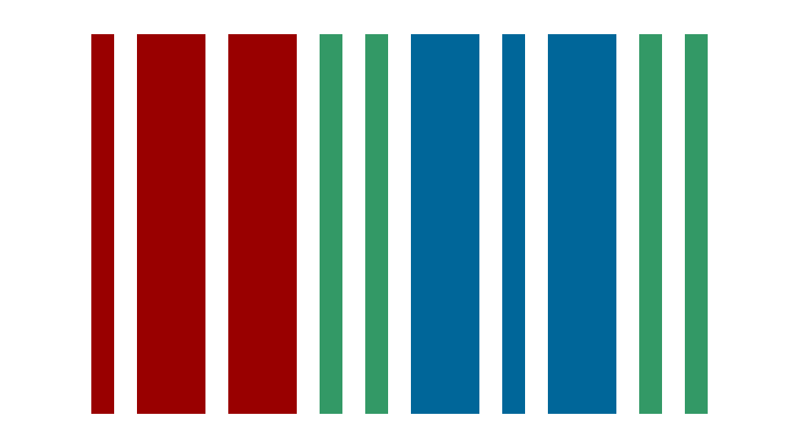

# Heimildir og aðferðir

| Svið | Helstu heimildir | Til hvers |
|---|---|---|
| Auðkenni tónlistar | MusicBrainz | flytjendur, hljómsveitir, plötur, útgáfur, upptökur, verk og tengsl |
| Æviágrip | Wikidata og útgefið efni | dagsetningar, fólk, staðir og atburðir |
| Útgáfur | Discogs | einstakar útgáfur, flytjendur og upptökustjórn |
| Vinsældalistar | Billboard, Official Charts og söfn | vikulegir vinsældalistar |
| Hlustun | Spotify | núverandi auðkenni og tenglar á plötur og lög |
| Kvikmyndir og sjónvarp | TMDB og IMDb-auðkenni | kvikmyndir, þáttaraðir, einstakir þættir og dagsetningar |
| Tónlist á skjánum | IMDb (soundtrack-skráning) og TMDB | hvaða kvikmyndir og þættir nota lögin, og vinsældir þeirra |
| Umslög og myndir | Cover Art Archive og Wikimedia Commons | plötuumslög og myndir af flytjendum |
| Söngtextar | Genius | textarnir birtast í spilara Genius sjálfs; þeir eru aldrei afritaðir |
| Greining | eigin kóði, handvinnsla og gervigreind | þemu, tilgátur, tengslanet og afleiddir mælikvarðar |

## Gagnaveitur

[{.provider-logo}](https://musicbrainz.org)
Flytjendur, plötur, upptökur, verk og tengsl koma frá MusicBrainz (CC0).

[{.provider-logo}](https://coverartarchive.org)
Plötuumslög koma úr Cover Art Archive; höfundarréttur umslaganna er hjá rétthöfum.

[{.provider-logo}](https://www.wikidata.org)
Dagsetningar, staðir, fólk og tengsl koma frá Wikidata (CC0).

[{.provider-logo}](https://en.wikipedia.org)
Samantektir og tilvitnanir úr ensku Wikipediu (CC BY-SA 4.0) eru merktar við hvern kafla.

[{.provider-logo}](https://commons.wikimedia.org)
Myndir af flytjendum og hljóðbrot koma af Wikimedia Commons, með höfundi og leyfi við hverja mynd.

[{.provider-logo}](https://www.imdb.com)
Listinn yfir kvikmyndir og þætti sem nota lögin er lesinn af soundtrack-skráningu IMDb; hver titill tengist sinni IMDb-síðu.

[{.provider-logo}](https://genius.com)
Söngtextar birtast í spilara Genius og tenglar vísa á Genius.

[{.provider-logo}](https://www.spotify.com)
Tenglar á plötur og lög koma frá Spotify.

[{.provider-logo}](https://www.discogs.com)
Einstakar útgáfur og útgáfuupplýsingar koma frá Discogs („Data provided by Discogs“).

[{.provider-logo}](https://www.themoviedb.org)
Kvikmyndir og þættir eru fundnir og raðað eftir vinsældum með TMDB („This product uses the TMDB API but is not endorsed or certified by TMDB“).

Vikulegir Billboard-listar (Hot 100 og Billboard 200) koma úr safni [utdata/rwd-billboard-data](https://github.com/utdata/rwd-billboard-data) (MIT). Billboard á listana sjálfa.

## Uppruni gagna

Þegar heimildum ber ekki saman eru allar útgáfur varðveittar frekar en að ein sé valin í hljóði.

## Kvikmyndir og sjónvarp

Kvikmynd eða þáttur og sú fullyrðing að lag heyrist í honum eru tvær aðskildar staðreyndir. Fullyrðingin kemur úr soundtrack-skráningu IMDb, sem er lesin í vafra því IMDb hefur ekkert opið API og leyfir ekki sjálfvirka söfnun. TMDB er notað til að finna hvern titil eftir IMDb-auðkenni og raða eftir vinsældum (fjölda einkunna). Ef heimild nefnir lagið en ekki tiltekna upptöku er tengt við verkið í stað þess að giska á upptöku.

## Lógó

Lógóin í fæti síðunnar og hér að ofan vísa á heimildirnar og eru eign rétthafa sinna. Þau sem ekki komu frá veitunum sjálfum eru af Wikimedia Commons:

- MusicBrainz, Wikidata, IMDb og Genius: almenningseign ([MusicBrainz](https://commons.wikimedia.org/wiki/File:MusicBrainz_Logo_Icon_(2016).svg), [Wikidata](https://commons.wikimedia.org/wiki/File:Wikidata-logo.svg), [IMDb](https://commons.wikimedia.org/wiki/File:IMDB_Logo_2016.svg), [Genius](https://commons.wikimedia.org/wiki/File:Genius_Logo_2018.svg)).
- Cover Art Archive: MetaBrainz Foundation, CC BY-SA 4.0 ([Commons](https://commons.wikimedia.org/wiki/File:Cover_Art_Archive_Logo_(2020).svg)).
- Wikipedia: Nohat (hugmynd Paullusmagnus), Wikimedia, CC BY-SA 3.0 ([Commons](https://commons.wikimedia.org/wiki/File:Wikipedia-logo-v2.svg)).
- Wikimedia Commons: Reidab, Grunt, 3247 og Pumbaa, CC BY-SA 3.0 ([Commons](https://commons.wikimedia.org/wiki/File:Commons-logo.svg)).
- GitHub-merkið (fyrir Billboard-gögnin frá utdata): GitHub, MIT ([Commons](https://commons.wikimedia.org/wiki/File:Octicons-mark-github.svg)).

## Túlkun

Gerður er greinarmunur á staðreyndum með heimild, útgefinni túlkun, handunninni rannsókn, tilgátum sem gervigreind dró út og afleiddri greiningu verkefnisins. Þótt tvennt gerist á sama tíma eða fjalli um sama efni sannar það ekki orsakasamhengi.
